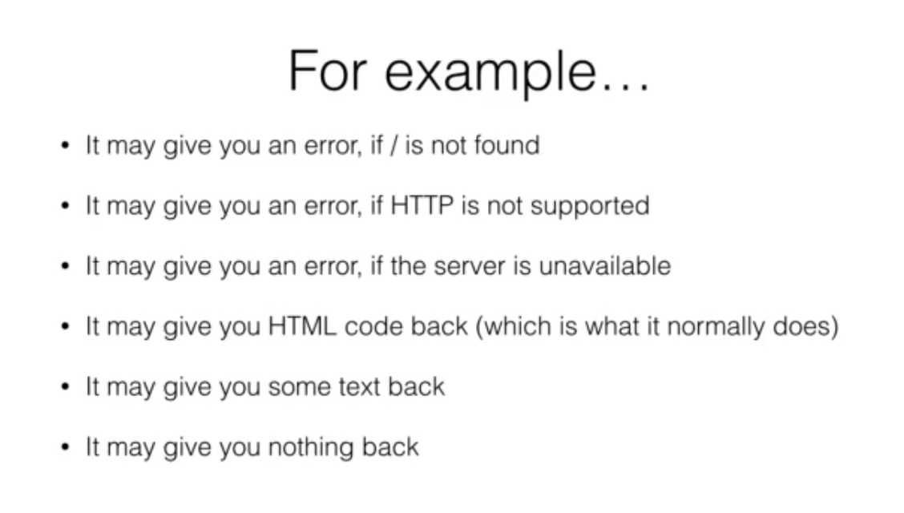
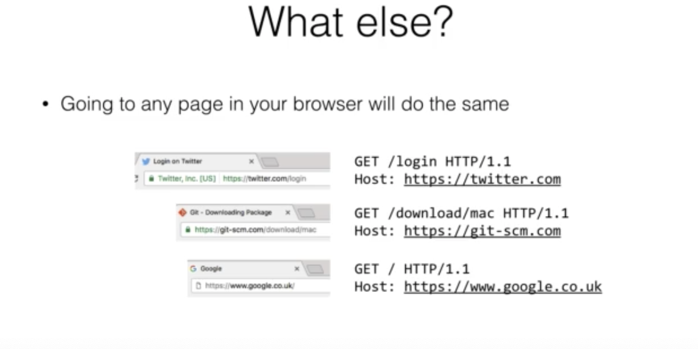
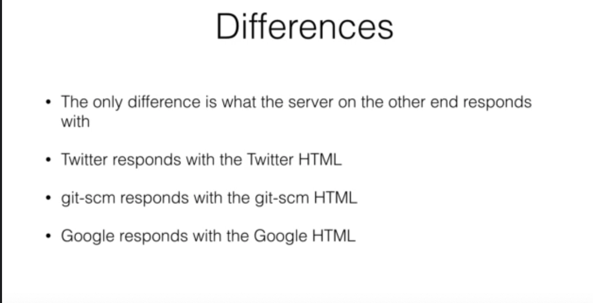
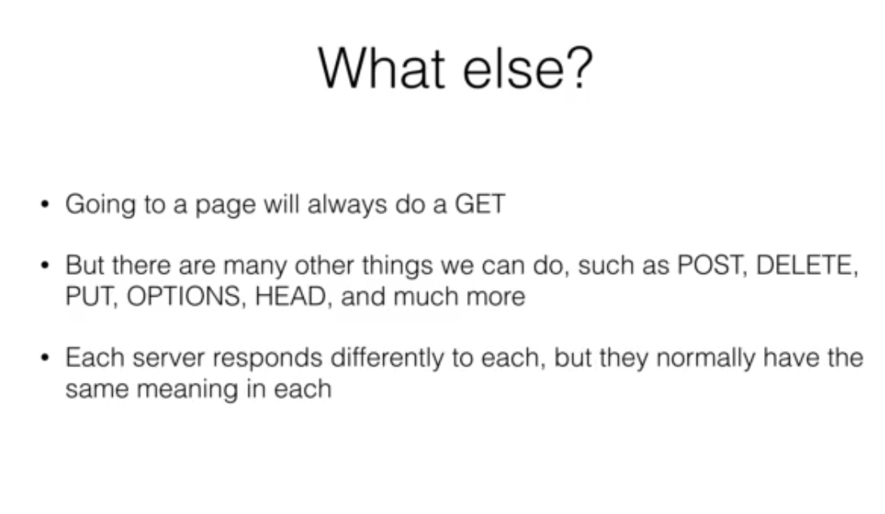

# What is a web server

A piece of software designed to accept imcoming web requests.

# What do we dend

When you go to http:www.google.com, you send the following

GET / HTTP/1.1 
HOST : www.google.com

GET : Verb

/ : Path

HTTP/1.1 Protocol

</img>

</img>

</img>

</img>

# HTTP Verbs

Verb|Meaning|example
-----|-----|-----
GET|Retrieve somthing|GET /item/1
POST|Receive data, and use it|POST /item --data {...}
PUT|Make sure somthing is ther|PUT /item --data {...}
DELETE|Remove somthing|DELETE /item/1

